# Devnotes

In this file, I will keep notes on development-related topics, including the current progress and additional ideas.

## Host Machine

(Managed in `src/system-setup/`)

- [ ] Automatic mount external drives (e.g., using `fstab`, maybe something on reboot)
- [ ] Set up automatic backups (e.g., using `rsync`) → Separate service?
- [ ] Set up firewall (e.g., using `ufw`)? Or is router enough?
- [ ] Set up network monitoring (e.g., using `nethogs`)

## Base Images

(Managed in `src/base-images/`)

- [ ] Set up zabbix agent for monitoring
- [ ] Set up automatic security updates (e.g., using `unattended-upgrades`)

## Services

(Managed in `src/services/`)

### `reverse-proxy`

- [ ] Set up automatic SSL certificate renewal (e.g., using `certbot`)
- [ ] Implement anti-abuse mechanisms (e.g., rate limiting, IP blocking)

### `papsite-live`, `papsite-stage`, `papsite-devtest`

- [ ] Set up automatic deployment (e.g., using Github webhooks, CGI scripts or similar)
- [ ] Generate helpful access report for analysis (e.g., using `goaccess`)

### `fileserver`

- [ ] Provide files to be served from a volume

### `ai-server`, `alpacabot`

- [ ] Set up Llama model using `ollama`
- [ ] Set up networking for chat bot access to LLM server

### `zettelbot`, `schaluppenbot`, `eheboostbot`

- [ ] Reactivate `make run` in entrypoint script (when old server will be down)

## Access Diagram

```mermaid
flowchart TD
    USER([User]):::external
    TELEGRAMAPP{{Telegram App}}:::external
    BROWSER{{Browser}}:::external
    TELEGRAMSERVER{{Telegram Server}}:::external
    subgraph MYHOME["My Home"]
        ROUTER{{Router}}
        subgraph SERVER["My Server"]
            MOUNTEDDRIVES[("Mounted Drives")]:::sensitive
            subgraph DOCK["The Dock"]
                REVERSEPROXY["Reverse Proxy (Nginx)"]:::unprotected
                PAPSITELIVE["Papierschiff Website (Live)"]:::unprotected
                PAPSITESTAGE["Papierschiff Website (Stage)"]
                PAPSITEDEVTEST["Papierschiff Website (Dev/Test)"]
                FILESERVER["File Server (WebDAV)"]
                ZETTELBOT["Zettelbot"]
                SCHALUPPENBOT["SchaluppenBot"]
                ALPACABOT["AlpacaBot"]
                EHEBOOSTBOT["EheboostBot"]
                AISERVER["AI Server (LLMs)"]
            end
        end
    end
    
    USER --> BROWSER
        BROWSER --🧱--> ROUTER
            ROUTER --> REVERSEPROXY
                REVERSEPROXY --> PAPSITELIVE
                REVERSEPROXY --🔒---> PAPSITESTAGE
                REVERSEPROXY --🔒----> PAPSITEDEVTEST
                REVERSEPROXY --🔒-----> FILESERVER
    USER --> TELEGRAMAPP
        TELEGRAMAPP --> TELEGRAMSERVER
            TELEGRAMSERVER --🔒---> ZETTELBOT
            TELEGRAMSERVER --🔒----> EHEBOOSTBOT
            TELEGRAMSERVER --🔒--------> SCHALUPPENBOT
            TELEGRAMSERVER --🔒-----> ALPACABOT
                ALPACABOT ---> AISERVER

    FILESERVER --👓🖊️--> MOUNTEDDRIVES
    SCHALUPPENBOT --👓--> MOUNTEDDRIVES
    AISERVER --👓---> MOUNTEDDRIVES
    
    classDef external fill:#333333;
    classDef unprotected fill:#463054;
    classDef sensitive fill:#882222;
```

